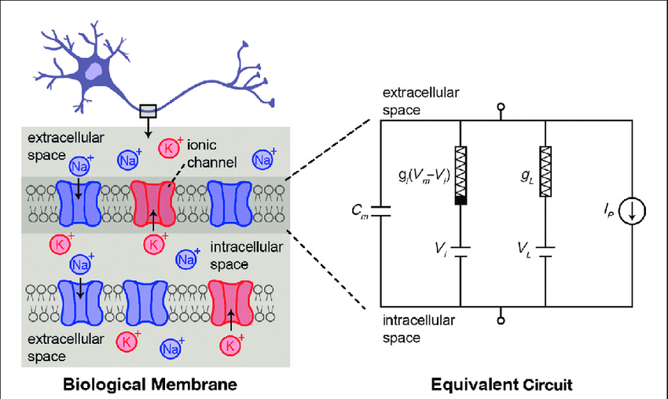

# Hodgkin–Huxley model 

The Hodgkin–Huxley model, or conductance-based model, is a mathematical model that describes how action potentials in 
neurons are initiated and propagated. It is a set of nonlinear differential equations that approximates the electrical 
engineering characteristics of excitable cells such as neurons and muscle cells. It is a continuous-time dynamical system.

Alan Hodgkin and Andrew Huxley described the model in 1952 to explain the ionic mechanisms underlying the initiation and 
propagation of action potentials in the squid giant axon.
They received the 1963 Nobel Prize in Physiology or Medicine for this work.

