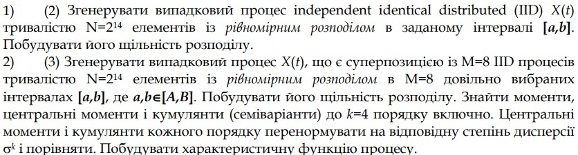

# Тема 1. (Yellow) Рівномірний розподіл. IID процеси. Середнє, дисперсія, коефіцієнти ексцесу та асиметрії. Характеристична функція. Центральна гранична теорема

  

## Part 1

1. **Середнє (Mean)**: середнє значення вибірки складає приблизно 9.42. Це є центральним тенденцією розподілу і вказує на те, де зосереджені значення.

2. **Дисперсія (Variance)**: дисперсія, яка становить приблизно 13.19, вказує на міру розкиду значень відносно середнього. Велике значення дисперсії може свідчити про широкий розкид вибірки.

3. **Стандартне відхилення (Standard Deviation)**: стандартне відхилення дорівнює близько 3.63 і представляє собою квадратний корінь з дисперсії. Це можна розглядати як міру розсіювання значень відносно середнього.

4. **Асиметрія (Skewness)**: значення асиметрії невелике (-0.003), що свідчить про те, що розподіл має невелику відхиленість від симетричності. У даному випадку, відхиленість від симетричності дещо в меншу сторону.

5. **Ексцес (Kurtosis)**: коефіцієнт ексцесу становить приблизно -1.20. Від'ємне значення куртозу вказує на те, що розподіл є менш вираженим (плоским) в порівнянні з нормальним розподілом.

## Висновок
Отже, висновок може бути наступним: отримані величини свідчать про те, що вибірка має середній рівномірний розподіл з невеликою асиметрією в меншу сторону і менш вираженим "острим" піком у порівнянні з нормальним розподілом.

## Part 2

1. **Середні значення (Mean)**: для кожного інтервалу між секціями були обчислені середні значення. Середні зростають з одного інтервалу до іншого, що вказує на зміну центральної тенденції в різних частинах діапазону.

2. **Дисперсія (Variance)**: дисперсія для кожного інтервалу також була обчислена. Загальна дисперсія є сумою дисперсій для кожного інтервалу. За результатами, дисперсія змінюється в межах від 0.4597 до 0.4646, що вказує на різний розкид значень в різних частинах діапазону.

3. **Загальне середнє (mean_o)**: загальне середнє значення обчислюється як сума середніх значень для кожного інтервалу, помножена на номер інтервалу, тобто вагована сума. У вашому випадку воно дорівнює близько 100.55.

4. **Загальна емпірична дисперсія (emp variance)**: загальна емпірична дисперсія визначається сумою дисперсій для кожного інтервалу. У вашому випадку вона становить приблизно 3.70.

5. **Моменти та центральні моменти**: обчислені моменти та центральні моменти розподілу. Моменти вказують на форму розподілу, а центральні моменти враховують відхилення від середнього значення.

6. **Кумулянти та нормовані кумулянти**: кумулянти використовуються для характеризації форми розподілу. Нормовані кумулянти враховують дисперсію і вказують на форму розподілу в порівнянні з розподілом Пуассона.

7. **Графік випадкового процесу (перший підграфік)**: графік випадкового процесу показує накопичення значень вздовж інтервалів. Зростання графіка свідчить про збільшення значень в межах кожного інтервалу.

8. **Емпіричний розподіл (другий підграфік)**: графік емпіричного розподілу показує, як розподіл значень реальної вибірки відхиляється від ідеального розподілу. Враховуючи аналіз нормованих кумулянтів, можна оцінити, наскільки розподіл відповідає теоретичному розподілу Пуассона.

9. **Формула для обчислення реальної та уявної частин функції розподілу (третій та четвертий підграфіки)**: графіки допомагають візуалізувати реальну та уявну частини функції розподілу, визначеної за допомогою моментів розподілу.

10. **Нормовані кумулянти**: значення нормованих кумулянтів вказують на те, наскільки розподіл відхиляється від теоретичного розподілу Пуассона та дозволяють провести порівняльний аналіз.

11. **Застосування методу розділення інтервалів**: застосування методу розділення інтервалів дозволяє вивчити локальні властивості розподілу вздовж визначених діапазонів, що може бути корисним при аналізі зміни розподілу в різних частинах діапазону.

## Висновок
Запропонована методика розділення діапазону та обчислення статистичних параметрів для кожного інтервалу дозволяє досліджувати зміну розподілу в різних частинах діапазону. Результати аналізу дозволяють отримати уявлення про характеристики розподілу в обраних ділянках.
Аналіз даних на локальних рівнях дозволяє отримати більш деталізоване уявлення про їхню структуру та особливості.